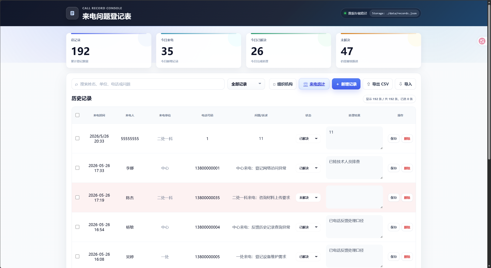
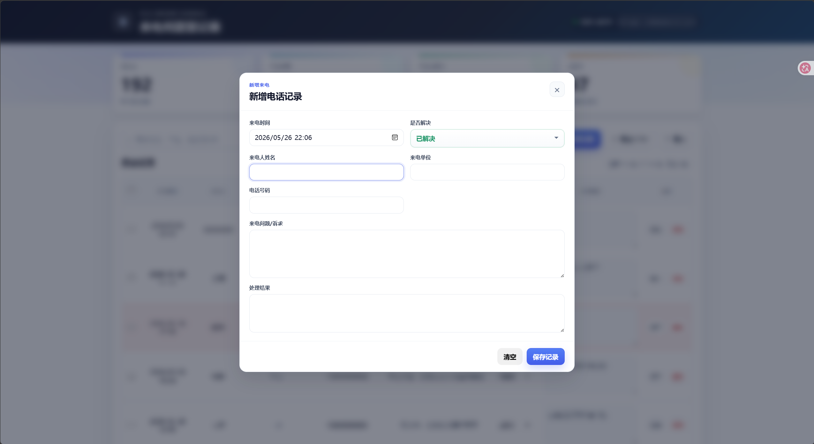
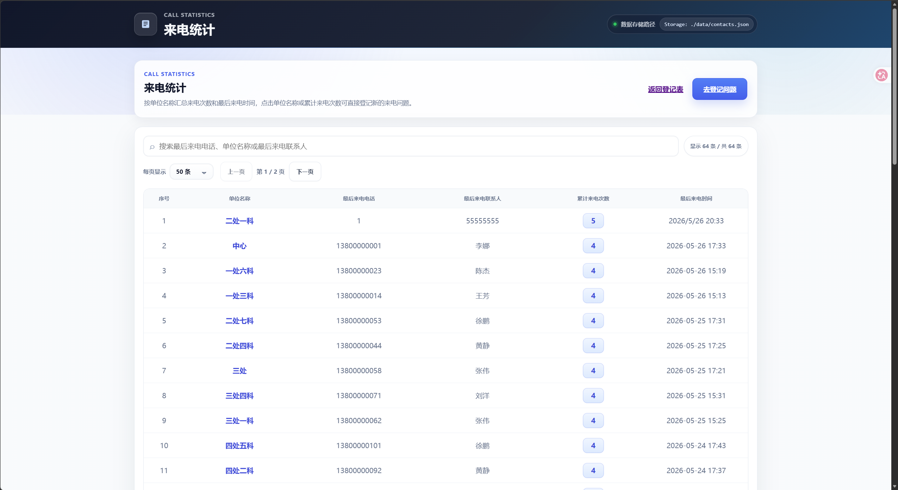

# 电话记录管理系统

轻量级电话记录管理系统，用于登记来电问题、跟进处理状态、管理通讯录和组织机构，支持搜索筛选、CSV 导入导出。

## 功能

- **来电记录管理**：登记来电时间、姓名、单位、电话、问题诉求、处理结果及解决状态
- **通讯录管理**：自动从来电记录同步，支持按单位/电话号码去重，累计来电次数
- **组织机构维护**：支持处/科两级架构（一处至七处，每处一至八科），来电单位必须从组织机构中选择
- **搜索和筛选**：按姓名、单位、电话、问题关键词搜索，按解决状态筛选
- **CSV 导出**：导出全部记录为 CSV 文件
- **CSV/JSON 导入**：支持合并导入或覆盖导入
- **JSON 文件持久化**：数据保存在 `data/records.json`，备份只需复制 `data` 目录

## 界面截图







## 部署方式

### 方式一：Windows Server 免安装包

适用于 Windows Server 2012 R2 及以上 64 位系统，无需安装 Node.js：

1. 从 [Releases](../../releases) 下载 `phone-record-app-win2012r-portable.zip`
2. 解压到目标目录
3. 双击 `start-windows.bat` 启动服务
4. 如需其他电脑访问，右键管理员运行 `allow-firewall-port-3000-admin.bat`

### 方式二：Node.js 直接运行

```bash
npm install
npm start
```

默认监听 `0.0.0.0:3000`，启动后控制台会打印本机和局域网访问地址。

## 访问方式

服务部署在 A 服务器后，所有电脑都访问同一个地址：

```
http://A服务器IP:3000
```

所有数据读写都在 A 服务器的 `data/` 目录下，不同电脑看到的是同一份数据。

## 修改端口

```bash
# Windows 命令行
set PORT=8080
start-windows.bat

# 或 Node.js 直接运行时
PORT=8080 npm start
```

## 测试

```bash
npm test
```

## 打包免安装包

```powershell
npm run package:win2012
```

产物生成到 `dist/phone-record-app-win2012r-portable/` 和对应的 zip 文件。

## 数据备份

复制发布目录下的 `data` 文件夹即可。不要在程序运行时手动编辑其中的 JSON 文件。

## 技术栈

- Node.js + Express
- 原生 HTML/CSS/JavaScript（无前端框架）
- JSON 文件持久化
