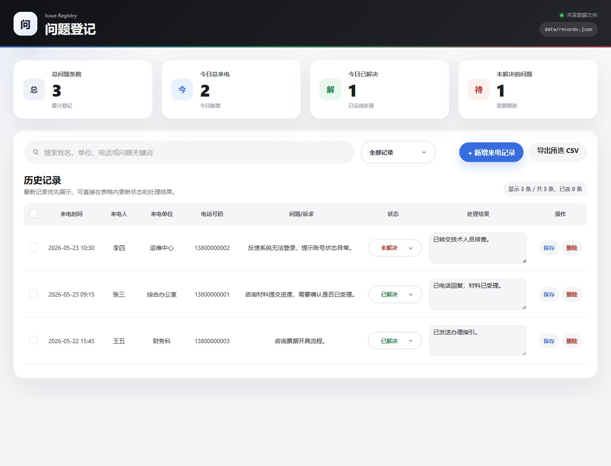

# 电话记录管理系统

轻量级电话记录管理系统，用于登记来电问题、跟进处理状态、搜索历史记录并导出 CSV。

## 产品截图



## 功能

- 新增来电记录：来电时间、姓名、单位、电话、问题诉求和处理结果。
- 历史记录管理：按最新来电时间展示，支持表格内更新解决状态和处理结果。
- 搜索和筛选：按姓名、单位、电话、问题关键词搜索，并按解决状态筛选。
- 数据统计：展示总问题数、今日来电、今日已解决和未解决问题。
- CSV 导出：支持导出选中记录。
- JSON 文件持久化：数据保存到运行目录的 `data/records.json`。
- Windows Server 2012 R2 免安装发布包：内置 Node.js 16.20.2 win-x64 运行时。

## 本地运行

```bash
npm install
npm start
```

默认监听 `0.0.0.0:3000`。启动后控制台会打印本机和局域网访问地址。

## 测试

```bash
npm test
```

## 打包 Windows Server 2012 R2 免安装包

```powershell
npm run package:win2012
```

打包产物会生成到：

```text
dist/phone-record-app-win2012r-portable/
dist/phone-record-app-win2012r-portable.zip
```

目标服务器解压 zip 后双击 `start-windows.bat` 即可运行；如果同网段电脑无法访问，右键管理员运行 `allow-firewall-port-3000-admin.bat` 放行端口。

## 数据说明

真实数据文件 `data/records.json` 不提交到 Git。首次运行时程序会自动创建空数组文件。
